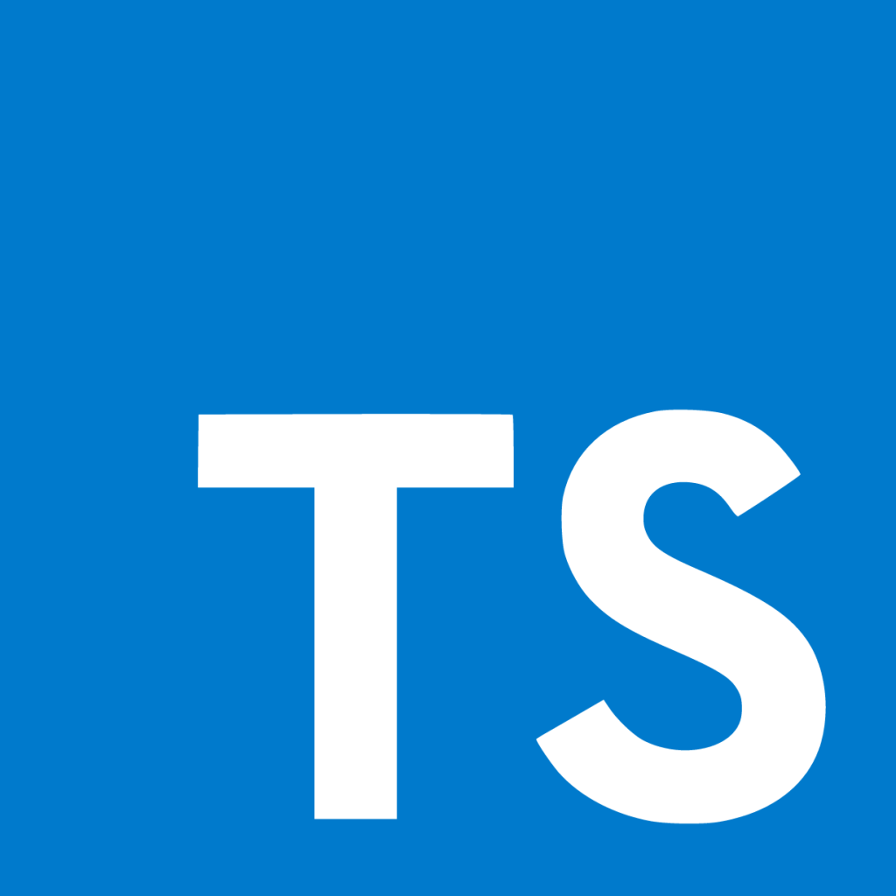
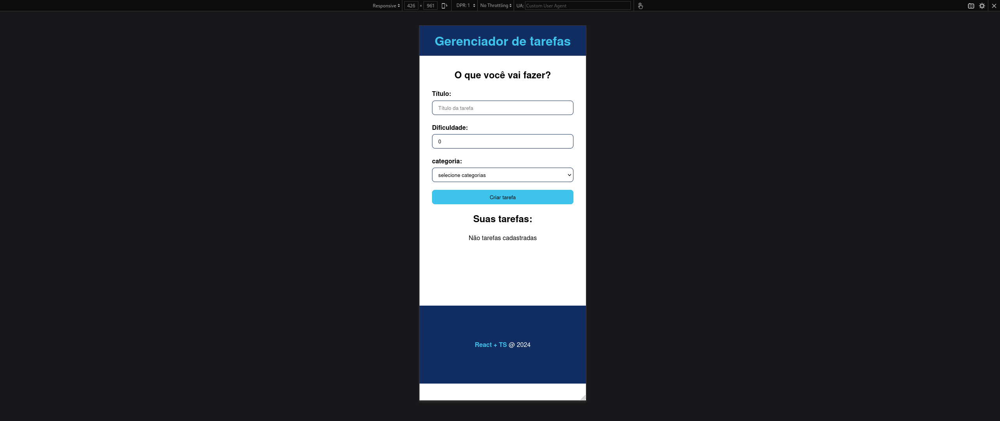

<h1 align="center">Task manager</h1>

<p align="center">
  
  
  
</p>

<h3>Faça o download do repositório:</h3>


> [!TIP]
> Segue um exemplo usando o protocolo: ssh

```
  git clone git@github.com:fabianaevaristo/taskmanager.git
```

<h3>Faça o download das dependências:</h3>

```
  npm install
```

> [!WARNING]  
> O gerenciador de pacotes usado no início do projeto foi o npm, é aconselhável mantê-lo.

<h3>Rode o projeto:</h3>
```
  npm start
```

<p align="center">
  <h3 align="center">DESKTOP</h3>
  
</p>
<p align="center">
  <h3 align="center">MOBILE</h3>
  
</p>
